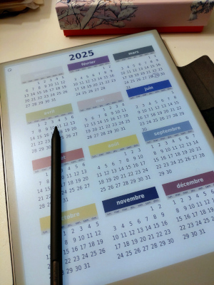

# reMarkable PDF calendar

Page-per-day calendar, generated for Remarkable tablet.

French school and bank holidays can be included.

This project is a fork of [pdfcal](https://github.com/osresearch/pdfcal).




## Build calendar

Initialize build env and generate:

``` shell
$ python -m venv env
$ source env/bin/activate
(env)$ python -m pip install -r requirements.txt
(env)$ ./make-calendar
```

To include French school and bank holidays, set current locale to
`fr_FR` and specify a zone for the school holidays (`--school-zone`)
and/or a bank holiday zone (`--bank-holidays`):

``` shell
(env)$ ./make-calendar --school-zone C --bank-holidays Métropole
```
